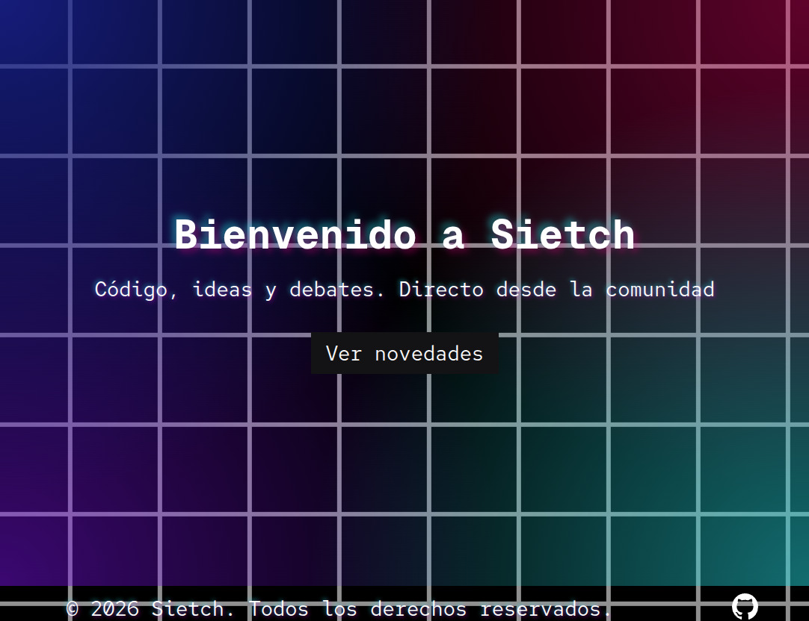
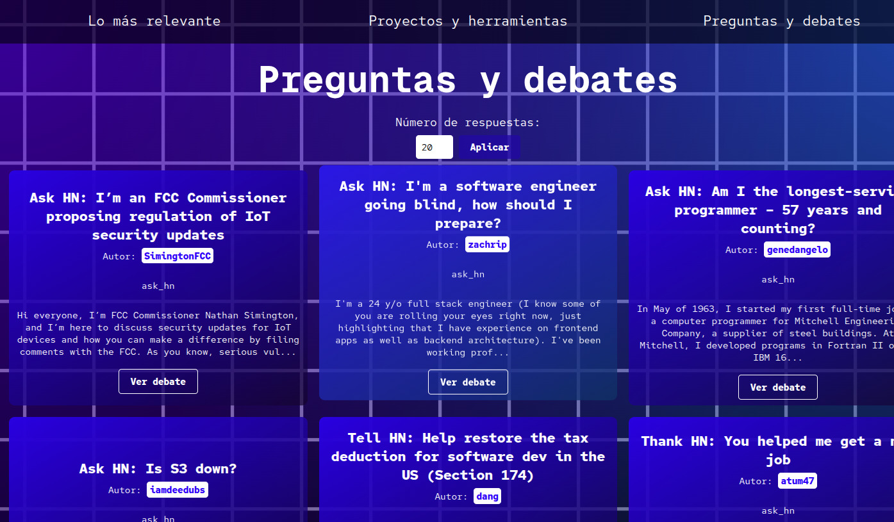

# Sietch
We are **3-factorial**, a team of students pursuing a degree in Information Technologies for Sciences (TIC) at the Universidad Nacional Autónoma de México, Morelia campus.


## 3-factorial is composed of:
* **Emmanuel Gutiérrez**: Project Leader and QA/Testing Engineer.

* **Francisco Santana**: Technology Leader.

## Installation Instructions
```bash

# Create a virtual environment and install dependencies
python3 -m venv env
source env/bin/activate
pip install -r requirements.txt

# Run the local server
python manage.py runserver
```

The microservice is already deployed and live in production. You can test it directly at our [AWS Server](http://100.27.149.64:8000).

## About Sietch
This is our microservice called Sietch.



Sietch is designed to filter and organize news from Hacker News, a portal specialized in the latest tech trends. The system extracts data from the Algolia API, cleans it, and delivers it in an optimized, user-friendly format, perfect for a card-based web interface grid.

## Interface Filters
The interface features 3 distinct filters:

* Mas Relevante: This section displays the most recent news or stories with new user interactions.

* Proyectos y Herramientas: This section highlights projects and tools that other users share with the community.

* Preguntas y Debates: This section gathers tech-focused questions, discussions, and debates started by other community members.



## References
Algolia API: [API Link](https://hn.algolia.com/api/v1/search?tags={filter}&hitsPerPage={n_news})

## License
This project is licensed under the GPL-3.0 License.